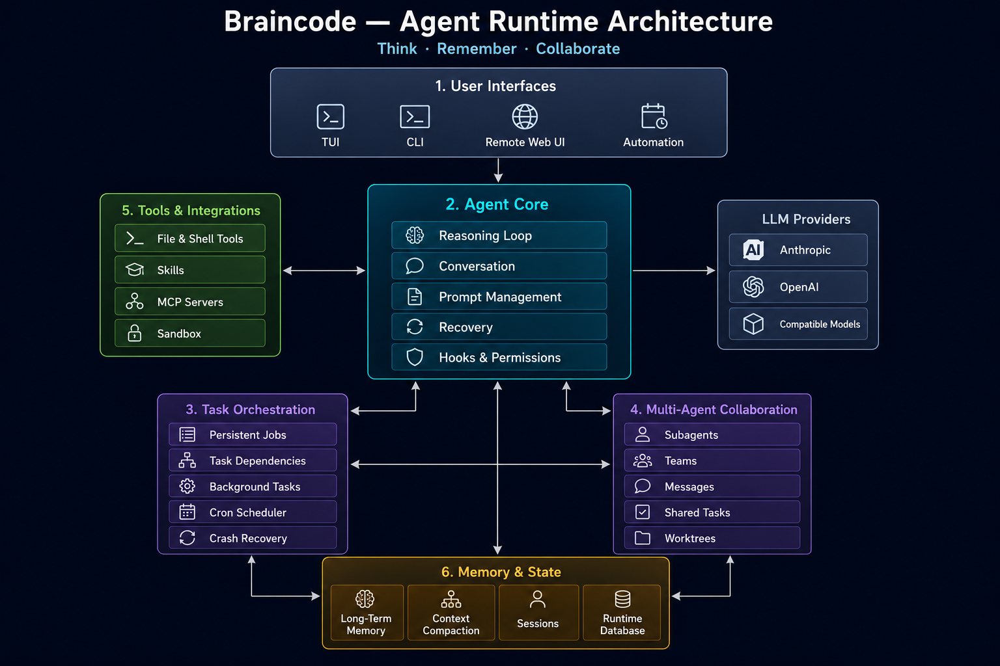

<p align="center">
  
</p>

<h1 align="center">Braincode</h1>

<p align="center">
  <strong>Think · Remember · Collaborate</strong>
</p>

<p align="center">
  让 Agent 像人脑一样思考，拥有记忆，并学会合作。
</p>

---

## Introduction

Braincode 是一个使用 Python 构建的开源 AI Coding Agent Runtime。

它不仅能够调用工具完成编码任务，还尝试让 Agent 具备更加完整的认知与协作能力：

- 像人脑一样进行推理和规划
- 从历史交互中形成长期记忆
- 管理复杂任务和上下文
- 调用工具、Skills 与 MCP 服务
- 创建 Subagent 并进行多 Agent 协作
- 通过 Worktree 隔离并行开发任务
- 在权限和 Sandbox 保护下安全执行操作

## Core Concepts

Braincode 围绕五个核心方向构建：

### Think

Agent 通过模型推理、上下文管理、Prompt 组装和恢复机制持续完成复杂任务。

### Remember

项目支持 Session、长期记忆、记忆检索、上下文压缩和历史恢复。

### Act

Agent 可以调用文件工具、Shell、Skills、MCP 和自定义命令操作真实项目。

### Collaborate

Subagent 和 Agent Team 可以分工、通信、共享任务并使用独立 Worktree。

### Recover

系统能够处理上下文超限、输出截断、模型异常和长期任务恢复。

## Architecture

Braincode 的整体运行流程：

```text
User Interfaces
       ↓
   Agent Core
   ├── LLM Providers
   ├── Memory & State
   ├── Tools & Skills
   ├── Task Orchestration
   └── Multi-Agent Collaboration

